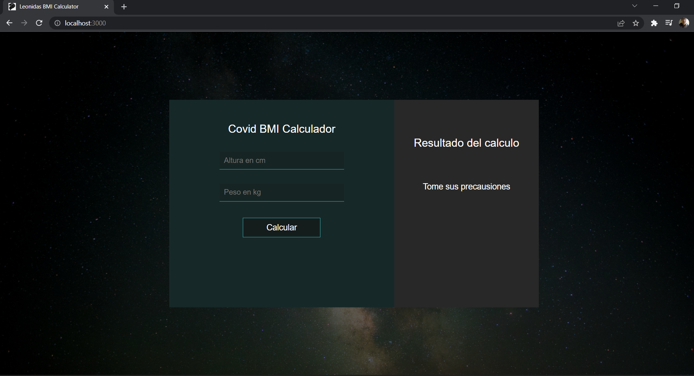

# BMI Calculator Covid

## Descripción
Calculator covid

## STACK
- HTML5
- CSS3
- JavaScript
- ReactJs

## Instalación

Clonar el proyecto

```bash
  git clone https://github.com/JesusLeonChavez/Demo3-bmi-calculator-covid.git
```

Instalación 

```bash
  npm i
```

Iniciar Cliente

```bash
  npm start
```

## Rutas públicas
Rutas accesibles:

* Home

